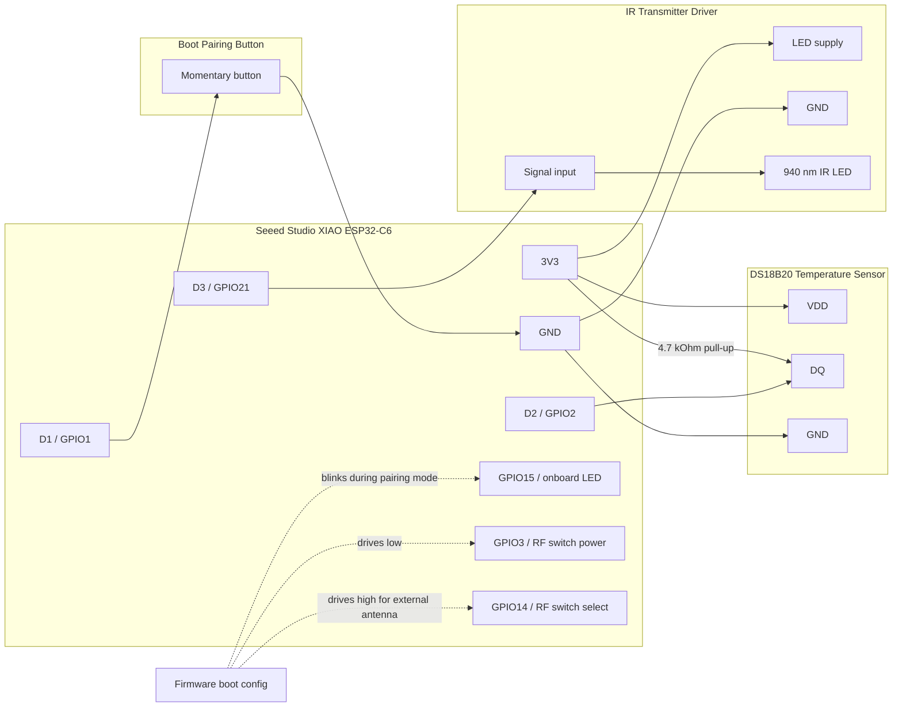

# Ströme AC

Matter-compatible IR controller for the Ströme AC YPS-12C using Seeed Studio XIAO ESP32-C6 and ESP-Matter.

The device exposes a Matter Room Air Conditioner endpoint and transmits Trotec 3550-compatible IR state frames for power, mode, and cooling setpoint changes. Because the AC does not report state back over IR, the Matter AC state is optimistic. Local temperature is reported from a DS18B20 external temperature sensor on GPIO2, with a 20.0 C fallback until a valid sensor reading is available.

Note: This project is still a work in progress. Some parts of the code and documentation have been refactored with AI assistance.

## TODO

- Swing control
- Timer control
- Fan speed control
- Addition of Dry and Fan modes

## Home Assistant Matter Device

These screenshots show the added Matter device in Home Assistant. The detailed view exposes the measured local temperature, cooling setpoint, and Cool mode control.


The area card shows the same Matter device as a compact room control.


## Hardware Wiring

The reference board is the [Seeed Studio XIAO ESP32-C6](https://wiki.seeedstudio.com/xiao_esp32c6_getting_started/). The XIAO pin map lists D1 as GPIO1, D2 as GPIO2, D3 as GPIO21, and GPIO15 as the user LED. This project uses them for boot pairing, the DS18B20 data line, IR transmitter output, and the pairing indicator.



| XIAO pin | ESP32-C6 GPIO | Connected hardware | Notes |
|----------|---------------|--------------------|-------|
| D1 | GPIO1 | Boot pairing button to GND | Active-low, internal pull-up enabled |
| D2 | GPIO2 | DS18B20 DQ | Add 4.7 kOhm pull-up to 3.3 V |
| D3 | GPIO21 | IR transmitter driver input | Manual 38 kHz carrier output |
| Onboard user LED | GPIO15 | Pairing mode indicator | Blinks while boot-requested Matter commissioning window is open |
| 3V3 | 3.3 V | DS18B20 VDD, pull-up, low-current logic supply | Use a proper IR LED driver for LED current |
| GND | GND | Common ground | Shared by ESP32-C6, DS18B20, and IR driver |
| RF switch power | GPIO3 | XIAO RF switch control | Driven low before selecting antenna |
| RF switch select | GPIO14 | XIAO RF switch select | Driven high for external antenna |

## Boot Pairing Mode

Hold the D1 / GPIO1 button low during boot, then release it after startup logs begin. Startup continues while the button is held, and after Matter starts the firmware opens a Matter basic commissioning window for 300 seconds once GPIO1 is released. If GPIO1 stays held for 30 seconds, the firmware opens the commissioning window once anyway. This does not erase existing fabrics. GPIO15 blinks while this boot-requested pairing window is active, then turns off when commissioning completes, fails, or the window closes.

After normal boot, holding the same GPIO1 button for 15 seconds factory-resets the Matter commissioning data. GPIO15 fast-blinks five times to confirm the reset request, then the ESP-Matter reset flow reboots the device into a fresh commissioning state.

## Included Components

- [feelfreelinux/ds18b20](https://github.com/feelfreelinux/ds18b20): Original source for the DS18B20 1-Wire temperature sensor library used in `components/ds18b20`.
- [crankyoldgit/IRremoteESP8266](https://github.com/crankyoldgit/IRremoteESP8266): Reference implementation for the Trotec 3550 IR protocol used by the Ströme AC YPS-12C frame encoder.

## Docs

- [AC controller overview](AC_CONTROLLER_README.md)
- [Trotec 3550 IR implementation](IR_IMPLEMENTATION.md)
- [Build and test guide](BUILD_AND_TEST.md)
- [Protocol documentation](Trotec_3550_IR_Protocol_Documentation.md)

## Build

```bash
idf.py set-target esp32c6
idf.py build
```
